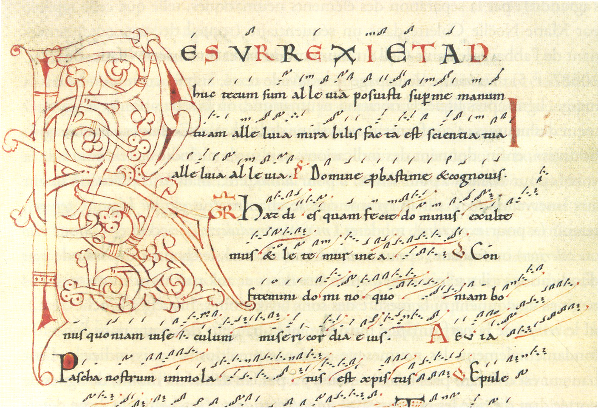
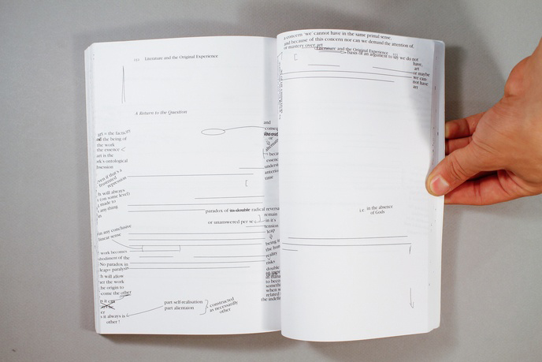
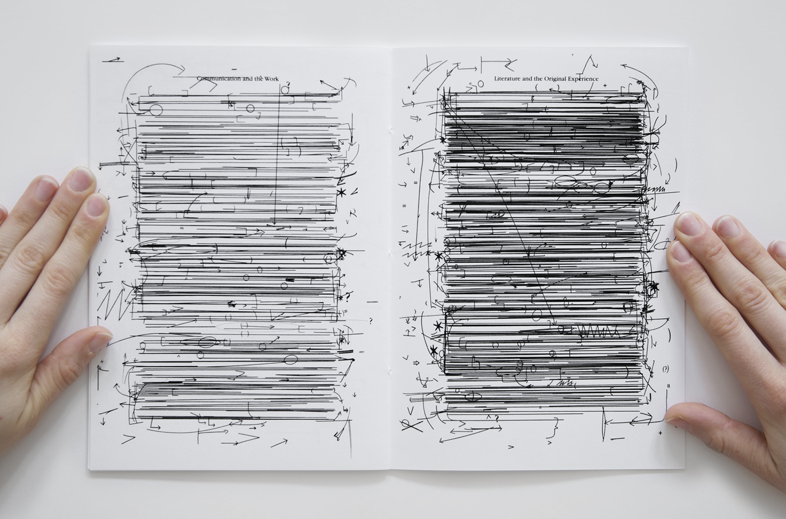

---
title: Secret Instructions
...

Il ne peut pas y avoir d’histoire de texte sans histoire de partition 
	  et d’histoire de lecture sans histoire d’incarnation. 

Aujourd’hui je suis là. 
  Où l’auteur devient compositeur et le compositeur, auteur.
 Postée à la frontière du texte littéraire et de la partition musicale. 
 Parfois *Taking-in*. Parfois *Acting-out*. Souvent *Taking-in and Acting out*. 

 Au Moyen Âge, il lisait sur la place publique. 
 À l’heure qu’il est, il se trouve dans le théâtre d’à coté. 
 J’ai perdu la carte.  

Où sera-t-il ce soir ?

«Tout ce que fait le moine dans le scriptorium est une sorte de prédication silencieuse de la parole. Illustrations comme vêtement de cérémonie qui fournissent à la parole incarnée dans la page un cadre à la hauteur de sa dignité.»1. »1 Citation de Cassiodore dans les écrits de L.Gougaud,   *Muta praedicatio - Revue bénédictrine Vol 42*, Belgique,   Brepol, 1930, p.171 Lorsque Cassiodore, écrivain du haut Moyen Âge, nous livre sa définition de la miniature des manuscrits de la même époque, il invoque sans ambiguïté le lien intime qu’entretiennent l’œil et l’oreille dans l’écriture de ses derniers. Développant l’imagination du lecteur, des initiales ornées, des lignes ondoyantes,  fig1 Gérard de Vivre, *Comédie de la fidélité nuptiale*,   1578, Bibliothèque nationale de France végétales, des figures animales ou hybrides animent les pages et scandent leur succession. De même que le prédicateur anime ses paroles par le geste, l’image illumine le sens de la parole écrite soutenant le son produit par les lignes lorsque le lecteur passe de l’une à l’autre. Les rythmes formels et chromatiques entretiennent alors un lien indiciel avec la performance musicale en soufflant aux lectures monastiques des indications heuristiques. En faisant «ressortir l'éclat »2 Ivan Illich, *Oeuvre complète Vol.2 - Du visible au lisible*,   Paris, Fayard, 2005, p.682  de la voix de la page » 2. En «honorant la parole en la revêtant de beauté»3.  »3. *ibid.*, p.682  L’écriture du Moyen Âge n’était donc pas considérée comme une chose fabriquée, mais bien comme une chose qui parle et qu’on entend passant de la bouche du prophète aux traces d’encre du scribe aux oreilles du peuple. Et c'est par l’entrelacement de ces deux sens que sont la Vue et l’Ouïe, que le moine nous met face à une symphonie.   
Dans la pièce de théâtre Comédie de la Fidélité nuptiale fig.1 publiée en 1578, Gérard de Vivre met au point un microsystème de ponctuation de sept signes indiquant le volume et le débit de la voix ainsi que la durée des temps de pause dans la diction. Je ferai ici un parallèle avec la notion de *modulatio*. Autrement dit, la variation des sonorités, du débit et des intonations qui sont au centre de la définition du *rythmus* donnée par le moine Bède : «Une modulatio sine ratione» (Une modulation sans durée). À partir de l’époque Carolingienne se développe une forme d’écriture musicale d’importance majeure pour le *rythmus*  (et par conséquent, le *modulatio*) tant dans le chant que dans l’art oratoire: les neumes fig.2.  Fig.2 *Graduel*, XIe siècle,   Bibliothèque municipale de Besançon Placés au dessus des syllabes ou dans les marges du texte, ce système de symboles de lettres ne retranscrivaient pas les sons, mais exprimaient le mouvement et les oscillations de la voix. Cette juxtaposition m’amène à considérer le moine comme Gérard de vivre dans l’endossement d’un double statut. Dans les deux cas, celui de compositeur puisque tous deux mettent en place un système d’image-signes complétant le texte d’indications supplémentaires, mais aussi puisqu’ils établissent des choix de composition dans la mise en scène de ces signe-images à la fois dans le texte et dans l’espace de la page. À ce rôle, j’ajouterais celui d’auteur pour Gérard de Vivre, puisqu’il écrit les textes qu’il publie, et de copiste au moine, puisqu’il recopie le texte d’un autre. 
C’est en décloisonnant les statuts de copiste, d’auteur et de compositeur que l’artiste Alexandra Bachtzetsis et la graphiste Julia Born publient *Secret Instructions* fig.3. Entre 2008 et 2014, elles réécrivent les pièces de théâtre d’Edward Albee,  Fig.3 Julia Born et Alexandra Bachtzetsis,   *Secret Instructions*, 2004-2010 de Samuel Beckett, de Berthold Brecht, d’Anton Chekhov, de Sarah Kane et d'Harold Pinter. Je ferai ici deux distinctions avec le moine copiste du Moyen Âge. D’une part, alors que ce dernier recopie mot pour mot le texte qu’il a devant lui, Julia Born et Alexandra Bachtzetsis décident de supprimer tous les textes parlés ne gardant lisible que les instructions de déplacement sur la scène. Ce choix les faisant glisser du statut de copiste à celui d’auteur, de nouvelles auteures d’un texte qui a déjà été écrit. D’autre part, alors que le moine ajoute, Julia Born et Alexandra Bachtzetsis effacent. C’est cette action qui me permet à la fois de les rapprocher et de les différencier dans le statut de compositeur. Alors que je les éloigne dans ma définition première du créateur de signes donnant des indications sur la lecture, je les rapproche dans ma définition seconde du metteur en scène d’un texte dans la page.

Je ne peux parler d’auteur et de compositeur sans parler d’œuvre littéraire et de partition musicale. Ce qui les distinguent, est en partie leurs finalités. Pour le philosophe Nelson Goodman, le compositeur «n’écrit pas une œuvre musical. Il écrit une partition qui détermine une classe d’interprétation qui doivent être concordantes.»4. »4 Tim Ingold, *Une brève histoire des lignes*,   Bruxelles, Zones sensibles, 2013, p.19  À la différence du texte littéraire, la partition ne fait pas œuvre en soi puisqu’elle n’aurait que pour unique fonction d’être jouée. C’est l’interprétation, l’incarnation de celle-ci qui fait œuvre. C’est donc dans sa relation au lecteur que je placerais davantage le manuscrit du Moyen Âge et la *Comédie de la Fidélité nuptiale* de l’ordre de la partition que du texte littéraire. En ce sens, tous deux ont pour première finalité d’être incarnés, si ce n’est d’avantage exécutés, à travers un système de notation définit arbitrairement et préalablement par l’auteur-compositeur. Dans leur lecture, domine l’idée d’un savoir ou d’une information à transmettre, laquelle a une dimension publique. L’auditoire lit par l’écoute le discourt d’autorité que lui livre le lecteur.  
Il est évident que je n’exclus pas l’importance de l’interprétation théâtrale dans *Secret Instructions* de Julia Born et Alexandra Bachtzesis puisqu’elle en constitue, au même titre que les exemples vu précédemment, une finalité. C’est donc à un autre niveau que je ferai une distinction. J’ai évoqué dans l’introduction les notions de *Taking-in* et de *Acting-out* repris dans *Une brêve histoire des lignes* de Tim Ingold. Distribués aux cinq futurs acteurs, les scripts à trous doivent être remplis individuellement sans prendre connaissance de celui de l’autre avant d’être incarnés sur scène. Au delà du travail d’exécution face auquel se trouve confronté le lecteur de la partition musicale (le *Acting-out*), il se trouve ici dans un exemple de cognition du texte qui doit obligatoirement être intériorisé afin d’être complété avant d’être joué. «Le premier cas (le *Taking-in*) est une opération qui nous conduit, par une intériorisation dans le champ de la pensée réflexive.»5.  »5 *ibid.*, p.20  Le texte physique tient par conséquent une place aussi importante que son incarnation par les acteurs sur la scène et c’est en ce sens que je définirais les *Secret Instructions* autant de l’ordre de l’œuvre littéraire que de la partition musicale tendant à mon sens à redéfinir la notion d’incarnation d’un script de théâtre. Je reprendrai ici les mots du poète et dramaturge Jean-Pierre Siméon dans *Lettre d'un poète à des comédiens et autres passeurs* : «Le travail du comédien doit être d’assurer, avant l’auditeur, le doute du sens. Bref, il s’agit qu’il soit, dans les premières lectures intimes et solitaires du texte, agité de la question : qu’en est-il donc du sens ? Non pour la résoudre avant et à la place de l’auditeur, mais pour vivre intérieurement ce débat du sens dont sa diction s’argumentera. Que le comédien donc commence par jouir du texte à son profit, sans égards pour personne. Qu’il ne cherche pas le sens lisible mais la lisibilité du sens. Qu’il l’ait une fois éprouvé pour lui même et qu’il nous restitue sa confiance.»6.  »6 Jean-Pierre Siméon, *Algue, sable, coquillage et crevettes   - Lettre d’un poète à des comédiens et à quelques autres passeurs*,   Le Chambon-sur-Lignon, Cheyne Éditeur, 1997, p.36  Le lecteur change de statut. Alors qu’il lui suffisait de restituer avec exactitude la structure de pensée d’un tiers à haute voix quand bien même il n’en ai jamais connu le contenu auparavant, Julia Born et Alexandra Bachtzesis créent les conditions obligeant le lecteur à endurer le texte avant de le livrer au public. 

Je voudrais insister sur la notion d’*Acting-out* qui pour moi se situe à deux niveaux dans ce que propose Julia Born et Alexandra Bachtzesis. Dans un premier temps et comme je l’ai évoqué précédemment, dans l’idée d’une extériorisation d’un texte sur la scène. Au moment où les acteurs se réunissent, leur performance est en partie contrôlée, en partie
sous-jacente à leurs interprétations personnelles ou au facteur du hasard. Chaque interprète évolue pour devenir un
protagoniste, un metteur en scène mais aussi un élément passif dans l’interprétation de chaque autre participant. Cette manière de penser le script de théâtre induit d’ailleurs un nouveau rapport au public qui évolue en même temps que l’acteur dans l’action. Il est en quelque sorte engagé dans le déroulement de la scène puisqu’il est témoin de ce qui se passe et qu’il se crée sa propre histoire en même temps que les acteurs. Je reprendrai de nouveau Jean-Pierre Siméon : « Nous ne demandons pas qu’il (le comédien) montre le chemin ni son habileté à cheminer, mais qu’il nous engage à cheminer en ouvrant sous nos pas les lieux du poème.»7.  »7 *ibid.*, p.37  
Dans un deuxième temps, dans l’intervention manuscrite au sein même des pages fig.4.  Fig.4 Julia Born et Alexandra Bachtzetsis,   *Secret Instructions*, 2004-2010  Le *Acting-out* ne se caractérisant plus par l’incarnation d’un texte par les acteurs mais bien de l’incarnation des acteurs dans le texte. L’acteur occupe le texte autant qu’il est occupé par ce dernier. Le *Acting-out* comme «un exemple d'exécution qui se conforme aux instructions écrites»8  »8 Tim Ingold, *Une brève histoire des lignes*,   Bruxelles, Zones sensibles, 2013, p.20  pour reprendre les mots de Tim Ingold, ne se joue donc pas uniquement à l’échelle de la scène mais également à l’échelle du texte. L'espace blanc laissé par l'effacement du texte s'apparente à mon sens à une instruction écrite : L'acteur doit remplir le texte avant de le jouer. Il doit laisser la trace de son *Taking-in* que je définis donc comme un premier *Acting-out* obligatoire pour jouer le second sur scène. 

L’écriture d’une œuvre littéraire, au même titre qu’une partition musicale, passe par la mise en page et le travail de composition d’un système de notation. Qu’il soit de l’ordre du signe ou de la lettre. Au milieu du XIIe siècle, l’auteur prend conscience que la mise en page fait partie d’un ensemble visuel qui favorise la compréhension du lecteur. On assiste alors à une avalanche de systèmes permettant de classifier et de hiérarchiser les écrits : Index, catalogue de bibliothèque, mise en page en chapitre, numérotation des versets, tables des matières, résumés en début de chapitre, introduction, variation de corps au sein du texte... Dans *Les Sentences* fig.5,  Fig.5 Pierre Lombard, *Les Sentences*,   1158, Médiathèque de l’Agglomération Troyenne Pierre Lombard, théologien et évêque Italien du XIIe siècle, met en évidence les passages qu’il juge importants en rouge vif et ne laisse pas au lecteur le soin de reconnaitre lui-même les notes dans le texte en introduisant des guillemets primitifs au début et à la fin de chacune d’entre elles et en citant en marge les références à la source qu’il cite. Ces Hors du Livre que Catherine Guiral nomme dans *(In)visible Touch*, le numéro 6 de la revue Faire parut en 2018, « Extra-livre » permettent au lecteur de comprendre le texte, les idées et les images qui se présentent à lui. Catherine Guiral s'attarde quelques lignes sur le signe typographique Manicule Fig.6 que l'on trouvait dans les marges des manuscrits médiévaux sous la forme d'une main détachée de son corps, à l'index excessivement allongé et qui indiquait des passages importants pour le lecteur: «Cette main qui dit est une main qui montre et qui permet de saisir des lectures ne serait ce que parce qu'elle est l'élément clé entre le monde du livre et celui du lecteur.»9.  »9Catherine Guiral, «Invisible Touch»,   *Revue Faire*, n°6, 10 janvier 2018, p.9.    Fig.6 Manuscrit du procès des Coquillards,   1455, Archives départementales de Dijon  Je rapprocherai cette citation de sa définition du verbe saisir dans la même revue: «Ainsi du verbe saisir qui signifie l'action de prendre une chose avec plus ou moins de vigueur, de l'empoigner mais qui peut aussi par déplacement, évoquer le fait de discerner, de comprendre nettement.»10. »10 *ibid.*, p.9  Le signe typographie Manicule et l'intervention manuscrite des acteurs dans les scripts de Julia Born et Alexandra Batchezis servent autant l'une que l'autre d'élément de compréhension du texte. Dans les deux cas, la main dit et s'exprime dans un espace laissé libre par l'auteur. Dans un premier, par sa représentation figurative. Dans un second, dans la trace qu'elle laisse sur la page. 
Je me rapporte ici à l’ouvrage *Marginalia : reading in books de H.J Jackson* parut en 2002 dans lequel il analyse les marges annotées à la main de milliers d’ouvrages au cours des trois derniers siècles. Outre le fait que ni le texte initial, ni les notes n'avaient pour but d’être interprétés sur scène, ces interventions manuscrites avaient cette intime fonction de s'adresser à l'auteur mais aussi parfois à des amants, des amis, aux générations futures... Témoins d'un geste, d'un mouvement de la main sur la page, elles impliquent autant celui qui l’exécute que celui qui la reçoit. Ce mouvement, qui se rapporte à mon sens directement au signe du vivant intervient au sein d'un texte aux caractères typographiques imprimés figés sur la page. Je ferais ici un parallèle avec les *Secret instructions* où les deux graphistes effacent le texte préalablement imprimé des scripts écrient par des figures emblématiques du théâtre aujourd'hui décédés, favorisant l'intervention manuscrite des acteurs, quand à eux bien vivants. Je ne peux m'empêcher de voir dans cette décision de mise en page presque un manifeste d'émancipation de l'histoire du script et des auteurs qui lui sont associés.

Contestant la domination de la tradition théâtrale occidentale qui privilégie le texte, Richard Schechner, metteur en scène important dans le théâtre d’avant-garde américain et fondateur du Performance Group à New York explicite : «L’ensemble de cette vision scénique (didascalies) est à mon sens un échafaudage qui se démonte une fois que la pièce à pris forme grâce aux dialogues. C’est de cette manière que les drames classiques ont été transmis comme de simples dialogues débarrassés des didascalies. Je pense que la survie de la plupart de ces pièces tient au fait que les générations suivantes n’ont pas été encombrées par des didascalies et des descriptions de personnages.»11.  »11 Ricard Schechner,   *Performance - Expérimentation et théorie du théâtre aux USA*,   Paris, Éditions THÉÂTRALES, 2008, p.39  Je relèverais ici l’effacement comme condition à la pérennité d’un texte théâtral. Le lecteur ne se prête plus à la lecture de l’extériorisation de la structure de pensée de l’auteur mais bien à la construction d'une nouvelle narration qui répond à un besoin individuel à un instant précis.  Distribués aux cinq acteurs quelques temps avant la représentation, les textes évidés de Secret Instructions sont laissés à la charge des lecteurs devenant les nouveaux architectes du texte. Les menant alors d’une incarnation que je dirais transparente, où ces derniers se voient obligés d’éliminer du processus créatif la résistance et les obstacles posés par leurs propres organismes, à une incarnation que je dirais ajoutée, pour reprendre Richard Schechner, car créée par rapport à ce qu’ils sont lorsqu’ils cessent de jouer. Alors que le metteur en scène nous parle de supprimer les didascalies pour libérer les gestes du corps, les deux graphistes et artistes Julia Born et Alexandra Bachtzetsis, suppriment le texte parlé pour libérer également les gestes de l’esprit.
Le vide provoqué par l’effacement serait donc la condition de pérennité d’un texte théâtral parce qu’il permet l’expérience. Le texte, dans ce cas précis, sert de base, d’héritage d’un passé qui tend à être récupéré et retravaillé au profit d’une actualisation nécessaire passant par l’expérience nouvelle de celui-ci. Je m’appuierai sur la thèse du progrès cumulatif qui a émergé au 12e siècle et qu’on retrouve dans une maxime Vincent de Lérins: «non pas des nouveautés, mais de nouveau ou à nouveau». Autrement dit, de s’appuyer sur ce qui a existé pour le faire évoluer vers quelque chose de nouveau en créant les conditions pour qu’il soit poursuivi dans l’avenir. C’est à mon sens l’exacte démarche de Julia Born et Alexandra Bachtzesis.  Fig.7 Nick Thurston, *Reading The Remove Of Literature*,   Information as material, New-York, 2006  S’appuyant sur des scripts déjà existants, elles favorisent par leurs choix de mise en page l’expérience du texte plus que le texte lui-même.  Lors d’une discussion autour de la lecture avec l'artiste auteur Nick Thurston en janvier 2019, je lui ai envoyé les *Secret Instructions*. Ce à quoi il m’a répondu: «When I read the English translation of Maurice Blanchot’s L’espace litteraire, this is what happened...» accompagné d’une photographie de son ouvrage *Reading the Remove of Literature* fig.7 publié en 2006 dans lequel il a effacé le texte de Maurice Banchot pour ne laisser que ses indications et notes personnelles. Puis, «When Kristen Mueller read my reading of Maurice Blanchot’s L’espace litteraire, this is what happened...» accompagné d’une photographie de l’ouvrage *Partially Removing the Remove of Literature* fig.8de Kristen Mueller publié en 2014 dans lequel elle efface les interventions de Nick Thruston ne laissant que les indications non verbales et réunissant toutes les pages d'un chapitre sur une seule et même page.   Fig.8 Kristen Mueller,   *Partially Removing the Remove of Literature*, & So, 2014  Au même titre que dans les Secret instructions, l'expérience du texte surpasse le texte. 

J'en arrive presque à la conclusion que l'innovation théâtrale, passant à mon sens par une nouvelle définition des statuts de metteur en scène, d'acteur et de public, tend à faire disparaitre le texte. Ces dernières décennies ont d'ailleurs vu émerger des pratiques allant dans ce sens. Le metteur en scène, dramaturge et écrivain Berthold Brech développe dans les années 50 ce qu’il appelle dans le *Théâtre Épique*, l'effet de distanciation. Visant à briser le quatrième mur en faisant intervenir un personnage prenant à partie le spectateur en l’interpellant directement, la réaction de ce dernier est laissé au hasard et ne peut donc pas être scriptée. Plus récemment, le metteur en scène, dramaturge, écrivain et théoricien Augusto Boal va au bout de cette idée dans le *Théâtre-Forum*. Il demande aux acteurs d'improviser une scène où un des personnage agit pour obtenir un droit légitime mis en échec par les personnages antagonistes. À la fin de la scène, les spectateurs deviennent *Spect-Acteur* pour reprendre Augusto Boal, et sont invités à le remplacer sur scène en mettant en place des alternatives positives pour changer sa situation. Il n'y a aucun script. La figure du Joker conduit la réflexion collective le plus loin possible en soutenant l’interaction entre la salle et la scène en favorisant le débat, et en analysant avec le public leurs interventions, les réactions des personnages et les transformations apportées. Il créé donc les conditions pour qu’acteurs et spectateurs vivent une expérience nouvelle de la pièce au même titre que les *Secret Instructions* de Julia Born et Alexandra Bachtzesis. Or, dans le *Théâtre-forum*, le script s’émancipe du texte pour devenir un personnage vivant qui adapte son discourt à l’expérience vécue à un instant précis.  
Cependant, il me parait certain que le texte occupe une place importante et primordial dans un espace-temps différent. Peut-être non plus avant la représentation mais bien après en tant que moyen de restitution, de compte rendu de l'expérience vécue. Le témoin d'un passé révolu dans l'attente certaine d'être repensé. Je suis là, devant les archives de l'expérience. Devant ce qui me donne accès à ce qui s'est passé.

 Bibliographie
 . Ivan Illich, *Oeuvre complète Vol.2 -   Du visible au lisible*, Paris, Fayard 2005
 . Tim Ingold, *Une brève histoire des lignes*,   Bruxelles, Zones sensibles, 2011
 . Ricard Schechner, *Performance -   Expérimentation et théorie du théâtre aux USA*,   Paris, Éditions THÉÂTRALES, 2008
 . Jean-Pierre Siméon, *Algue, sable, coquillage et crevettes -   Lettre d’un poète à des comédiens et à quelques autres passeurs*,  Le Chambon-sur-Lignon, Cheyne Éditeur, 1997
 . Jean-Claude Schmitt, *Les Rythmes au Moyen Âge*,   Luçon, Édition Gallimard, 2016
 . Catherine Guiral, « Invisible Touch »,   *Revue Faire*, n°6, 10 janvier 2018
 